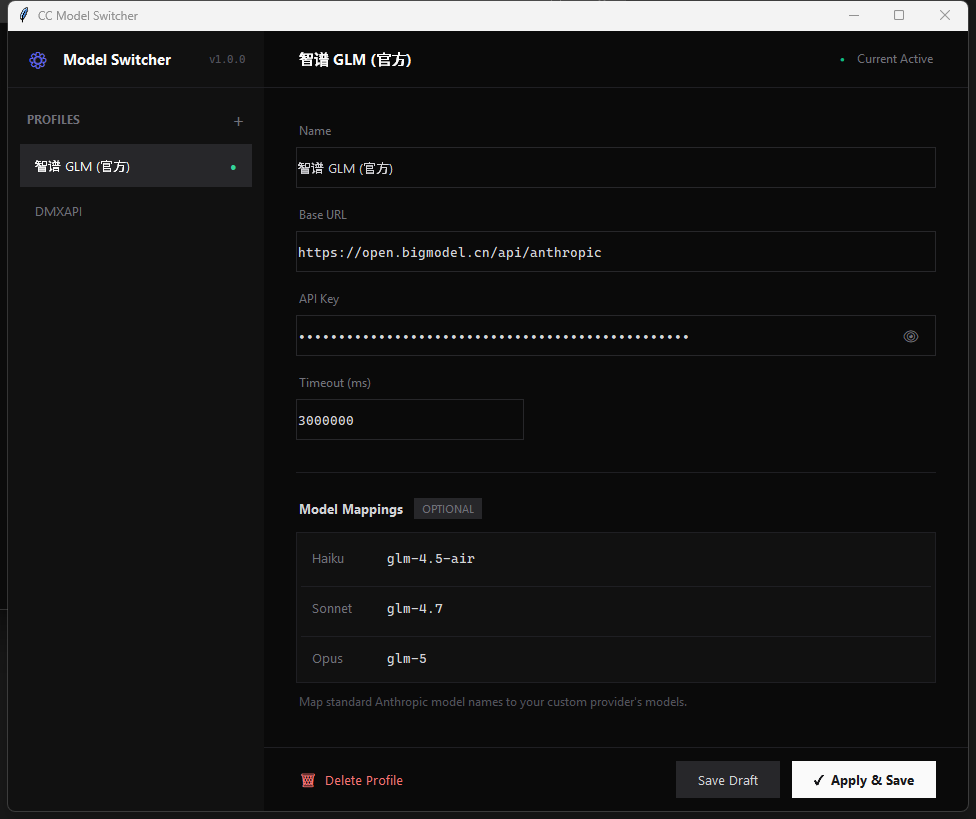

# CC Model Switcher

A minimal GUI tool for switching [Claude Code](https://docs.anthropic.com/en/docs/claude-code) API provider configurations.

<p align="center">
  
</p>

## Features

- **Multiple Profiles** — Save and switch between different API configurations
- **Custom Naming** — Name your profiles however you like
- **Secure** — API keys stored locally, masked by default
- **Auto Backup** — Backs up existing settings before applying
- **Cross-Platform** — Works on Windows, macOS, and Linux
- **Dark Theme** — Modern monochrome interface

## Installation

**Requirements:** Python 3.8+ with tkinter

```bash
# Clone the repository
git clone https://github.com/jlmaoju/cc-model-switcher.git
cd cc-model-switcher

# Run
python api_switcher.py
```

On Windows, you can double-click `run.bat`.

## Usage

On first run, an example profile is created automatically. You can edit it or create new ones.

1. Click **+** to create a new profile
2. Enter your API configuration:
   - **Name** — A label for this profile
   - **Base URL** — Your API endpoint
   - **API Key** — Your API key
   - **Model Mappings** — Optional model name overrides
3. Click **Apply** to save and activate the configuration
4. **Restart Claude Code** for changes to take effect

## How It Works

CC Model Switcher modifies Claude Code's settings file at `~/.claude/settings.json`:

```json
{
  "env": {
    "ANTHROPIC_BASE_URL": "https://api.example.com",
    "ANTHROPIC_AUTH_TOKEN": "your-api-key",
    "API_TIMEOUT_MS": "3000000",
    "ANTHROPIC_DEFAULT_HAIKU_MODEL": "model-name",
    "ANTHROPIC_DEFAULT_SONNET_MODEL": "model-name",
    "ANTHROPIC_DEFAULT_OPUS_MODEL": "model-name"
  }
}
```

Your profiles are saved in `saved_configs.json` in the same directory as the script.

## Security

- API keys are stored locally in `saved_configs.json`
- This file is in `.gitignore` and will not be committed
- Keep this file secure and do not share it
- A backup of `settings.json` is created before each change

## License

[MIT](LICENSE)

## Contributing

Issues and pull requests are welcome.
